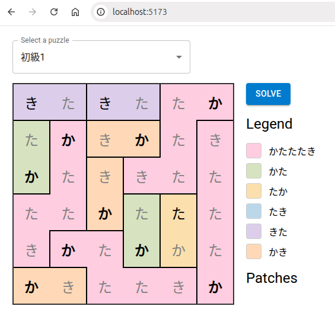

# かたたたき puzzle

As a 2025 Christmas gift, my wife gave me a puzzle book filled with this particular puzzle. I was solving it first by myself, with a pencil, but soon I found myself erasing and redoing the puzzle too many times. Clearly, I'm failing to meticulously apply the rules I've discovered. So I decided to bring out the big gun — programming!

Press "solve" and the solver will make progress.  The solver is not equipped with all the rules necessary to solve every puzzle on its own. You can help by clicking a border, which toggles the state between connected, separated, and unknown.

This is also my frontend programming practice project.
